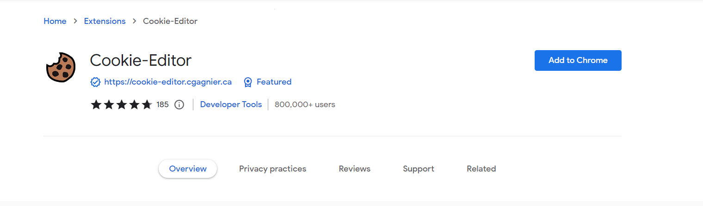
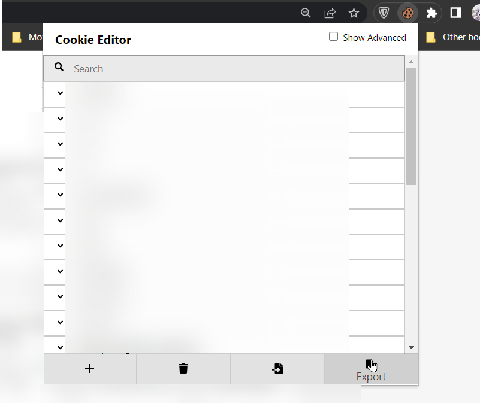
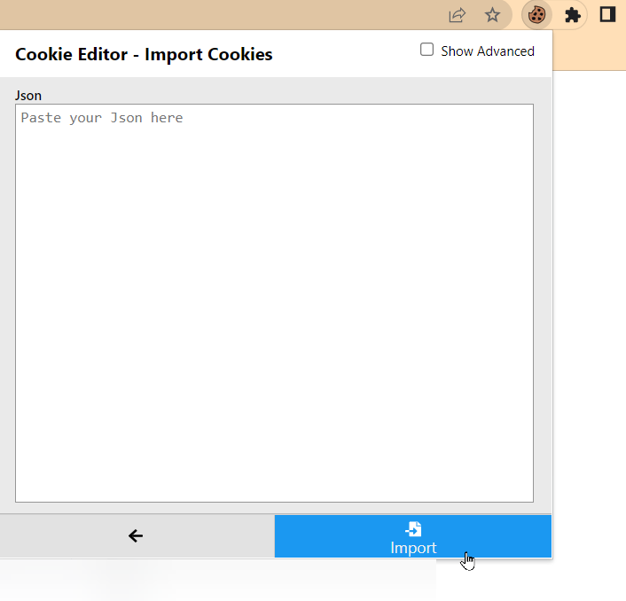

// add the - to publish
# What are Cookies?
Cookies are small text files with data used to personalize, save, and remember certain information about the user and their session. Different cookie types are used for various purposes. However, we'll focus on session cookies today because they save information like your username and password and are used to streamline your web experience.

While this might make you uneasy, cookies are safe and useful. For starters, they are kept locally on your computer and are only used by the server when your web browser needs them. Additionally, they enable stateful sessions on the internet. Stateful sessions are why when you log into a site, you are still signed in even when you close your browser or shut down your computer.

Imagine having to sign in each time you navigated to a different site, closed your browser, or had your shopping cart cleared because you navigated to another website. That wouldn't exactly be a nice experience, would it? Cookies prevent that nightmare from happening.

This short article will explain how you can share your accounts with friends or family without revealing passwords using cookies.

## Prerequisite
- [Google Chrome browser](https://www.google.com/chrome/)
- [Cookie-Editor](https://chrome.google.com/webstore/detail/cookie-editor/hlkenndednhfkekhgcdicdfddnkalmdm), which you can find at the [Chrome web store](https://chrome.google.com/webstore/category/extensions). This extension can import, export, edit, and create new cookies.

Install the Chrome extension, and let's eat; sorry, I mean, share some cookies.

# Importing Cookies
Let's assume you want to share the log-in details of abc.xy. 

1. Add the extension to Chrome browser by clicking on the "Add to Chrome" button.

